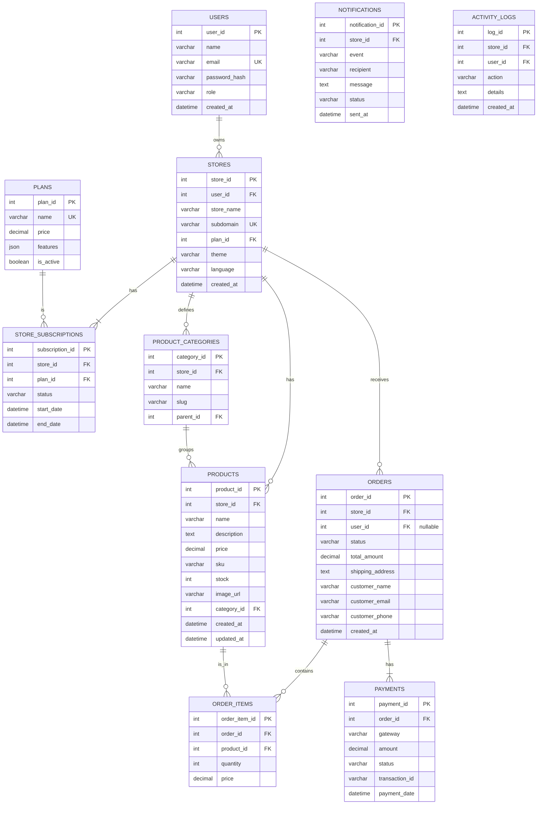

# NexusCart Technical Handoff & System Overview

**Date:** {current_date}
**Version:** 1.0

This document provides a comprehensive overview of the NexusCart application's architecture, database schema, feature status, and deployment requirements. It is intended for developers, project managers, and new team members.

**Core Architecture:** The application is built on a Next.js App Router framework. The backend logic is handled via **Next.js Server Actions** and **Genkit AI flows**, not a traditional REST or GraphQL API. The database is currently mocked using static TypeScript files (`src/lib/placeholder-data.ts`) and must be replaced with a production database.

---

## 1. Database Schema

**Current Status:** All data is currently mocked in `src/lib/placeholder-data.ts`. The following schema is the **proposed design** for a production-ready relational database (e.g., PostgreSQL).

### A. Entity-Relationship Diagram (ERD)

This diagram outlines the core relationships between the major entities.



### B. Table Breakdown

| Table Name             | Status                                             | Description                                                                 |
| ---------------------- | -------------------------------------------------- | --------------------------------------------------------------------------- |
| **Users**              | Not Implemented (Firebase handles this)            | Stores user account information. Firebase Auth is the source of truth.      |
| **Stores**             | Partially Implemented (Mock Data)                  | Core table for all stores created on the platform.                          |
| **Products**           | Partially Implemented (Mock Data)                  | All products listed by a store.                                             |
| **Product Categories** | Not Implemented (Mock Data for names only)         | Hierarchical categories for products within a store.                        |
| **Orders**             | Partially Implemented (Mock Data)                  | Records all customer orders for a store.                                    |
| **Order Items**        | Not Implemented (Logic is hardcoded)               | Line items for each order, linking products to orders.                      |
| **Payments**           | Not Implemented                                    | Tracks payment transactions associated with orders.                         |
| **Plans**              | Partially Implemented (Mock Data)                  | Defines the available subscription plans (Basic, Pro, etc.).                |
| **Store Subscriptions**| Not Implemented                                    | Associates a store with a specific plan and tracks its subscription status. |
| **Notifications**      | Not Implemented (Logic is ephemeral)               | Logs all outgoing notifications (WhatsApp, Email) for tracking.             |
| **Activity Logs**      | Not Started                                        | Logs significant actions performed by users within a store.                 |
| **Store Settings**     | Not Implemented (Part of mock `Store` type)        | Key-value store for various store-specific settings.                        |
| **Themes**             | Not Implemented (Handled by CSS)                   | Could store theme configurations if they become dynamic.                    |
| **Translations**       | Not Implemented (Handled by JSON files)            | Could store translations if moved from file system to DB.                   |

---

## 2. Features – Status Checklist

### Features 100% Complete
- **User Authentication (Firebase)**: Fully functional login and signup using Firebase Auth. UI and backend logic are complete.
- **Theme/Color Selection**: Theming system is fully implemented with 7+ themes. Users can select a theme, and it's applied across the dashboard and storefront. State is persisted in `localStorage`.
- **Multilingual Support**: The entire UI is translated into English and Nepali. A `useTranslation` hook and language files (`/src/locales`) manage all text. User preference is persisted.
- **AI Product Description (UI/Backend)**: The "Generate with AI" buttons on the Add/Edit Product pages are fully functional, calling a Genkit flow to populate the description field.
- **PWA Support**: The application is configured as a Progressive Web App with a manifest file and service worker registration.
- **Admin Actions (UI & Logic)**:
    - Products: "Edit" and "Delete" are fully functional.
    - Orders: "View Details," "Mark as Shipped," and "Cancel Order" are functional.
    - Settings: Saving "Store Profile," "SEO," and "Plan" changes works (with mock data).
    - Superadmin: "Add New Store" and store status changes are fully implemented.

### UI/Foundation Only (Backend Logic is Mocked or Incomplete)
- **Database Persistence**: All data is currently stored in `src/lib/placeholder-data.ts`. This is the **highest priority** item to refactor. All Server Actions currently modify this in-memory object.
- **Cloud Storage/Image Upload**: A `storage-service` exists and is integrated. It correctly uploads to a real Google Cloud Storage bucket if credentials are provided in `.env`, but falls back to placeholder images otherwise.
- **Product/Category Management**: Full UI exists, but data operations are on mock data. Category management logic (creation, editing, hierarchy) is not implemented.
- **Payment Gateway Integration**: UI for COD, eSewa, and WhatsApp is complete. The Server Action `placeOrder` creates mock orders for COD/eSewa. It does not connect to any real payment gateway API.
- **Plan Management & Subscription Logic**: UI for changing plans is complete. The backend action updates the mock data but does not handle billing, payments, or subscription lifecycle events (e.g., renewals, cancellations).
- **SEO/Meta Management**: UI is complete and saves to mock data.
- **Notification Flows (WhatsApp)**: The `sendWhatsAppNotification` flow is implemented. It will send real messages via Twilio if credentials are provided, but falls back to `console.log` otherwise. There is no persistent logging of sent notifications.

### Features Not Started
- **Activity Logs**: No UI or backend logic exists for logging user actions.
- **Real-time Analytics**: The dashboard uses static, mock analytics data.
- **Email Notifications**: No infrastructure or logic exists for sending emails.
- **CI/CD Pipeline**: No deployment automation is configured.

---

## 3. Backend Logic & "API" Documentation

The application uses **Next.js Server Actions** instead of a traditional API. All actions are defined in `src/app/.../actions.ts` files.

### Module: Products (`/app/(app)/products/actions.ts`)
- `addProduct(formData)`: Adds a new product. Uploads image via `storage-service`, creates a mock product object, and redirects.
- `updateProduct(productId, formData)`: Updates an existing product. Handles optional image replacement. Modifies mock data.
- `deleteProduct(productId)`: Deletes a product from the mock data array.
- `generateDescriptionAction(productName)`: Calls the Genkit flow to generate a product description.

### Module: Orders (`/app/(app)/orders/actions.ts`)
- `updateOrderStatus(orderId, status, lang)`: Updates the status of a mock order and triggers a WhatsApp notification flow.

### Module: Settings (`/app/(app)/settings/actions.ts`)
- `updateStoreProfile(storeId, formData)`: Updates a mock store's name and description.
- `updateStorePlan(storeId, newPlanId)`: Updates a mock store's plan.
- `updateSeoSettings(storeId, data)`: Updates a mock store's meta fields.
- `suggestKeywordsAction(description)`: Calls Genkit flow to suggest SEO keywords.

### Module: Checkout (`/app/store/checkout/actions.ts`)
- `placeOrder(values, cartItems, lang)`: The main checkout handler.
    - If payment method is 'whatsapp', it constructs a `wa.me` link.
    - If 'cod' or 'esewa', it creates a new mock order object and triggers notifications.

### Module: AI & Notifications
- **AI Flows (`/src/ai/flows/*.ts`):** Genkit flows for product description generation, SEO keyword suggestion, and a chat assistant. They are self-contained and called by Server Actions.
- **WhatsApp (`/src/ai/flows/whatsapp-notification.ts`):** A Genkit flow that uses the Twilio SDK to send messages. It has a graceful fallback to console logging if API keys are missing.

### Third-Party Integrations
- **Firebase**: For user authentication. Fully implemented.
- **Genkit (Google AI)**: For all AI features. Fully implemented.
- **Twilio**: For WhatsApp messages. Implemented with a "simulation" mode if keys are not present.
- **Google Cloud Storage**: For image uploads. Implemented with a placeholder fallback if not configured.

---

## 4. What’s Live, What’s Not

### Live & Production-Ready (Conceptually)
- User Authentication (Login, Signup).
- The entire user interface, including multilingual support and theme selection.
- All admin actions and forms, which are correctly wired to server actions.
- AI features for content generation.
- PWA configuration.

### UI Only / Mocked Backend
- **The entire data layer.** This is the most critical part that is **not production-ready**. All create, update, and delete operations manipulate an in-memory array and will be lost on server restart.
- Payment processing. The app does not connect to eSewa or any other gateway.
- Subscription billing. The app does not handle recurring payments or subscription lifecycle management.

### Not Started
- Activity logging and auditing.
- Real-time analytics data pipelines.
- Email sending infrastructure.
- Database backups, migrations, and seeding.

---

## 5. Deployment, Security, and Tech Stack

### Tech Stack
- **Framework**: Next.js 15.3.3 (App Router)
- **Language**: TypeScript
- **UI**: React 18, Tailwind CSS, ShadCN UI
- **Authentication**: Firebase Auth (Client-Side SDK)
- **AI**: Google AI via Genkit
- **Notifications**: Twilio API (for WhatsApp)
- **File Storage**: Google Cloud Storage

### Environment Variables
The following variables must be set in a `.env` file for full functionality. **Missing variables will cause features to run in a simulated/degraded mode.**

```env
# Firebase (Required for Authentication)
NEXT_PUBLIC_FIREBASE_API_KEY=
NEXT_PUBLIC_FIREBASE_AUTH_DOMAIN=
NEXT_PUBLIC_FIREBASE_PROJECT_ID=
NEXT_PUBLIC_FIREBASE_STORAGE_BUCKET=
NEXT_PUBLIC_FIREBASE_MESSAGING_SENDER_ID=
NEXT_PUBLIC_FIREBASE_APP_ID=

# Google Cloud Storage (Required for real image uploads)
GCS_PROJECT_ID=
GCS_BUCKET_NAME=
# The full JSON key file content as a single-line string
GOOGLE_APPLICATION_CREDENTIALS_JSON=

# Twilio (Required for real WhatsApp notifications)
TWILIO_ACCOUNT_SID=
TWILIO_AUTH_TOKEN=
TWILIO_WHATSAPP_FROM_NUMBER=
```

### Security Measures
- **Authentication**: Handled by Firebase Auth, which is robust and secure.
- **Input Validation**: Client-side validation is performed with `zod` and `react-hook-form`. Basic server-side checks are present in most actions. This should be made more robust when moving to a real DB.
- **Route Protection**: The `middleware.ts` file routes traffic based on hostname and sets a `x-store-id` header. It does not currently protect routes based on user authentication status or role; this should be added.
- **CORS**: Handled by Next.js defaults.
- **Password Storage**: Handled securely by Firebase.

### Recommendations
- **Add Authentication to Middleware**: The middleware should be updated to protect admin routes (`/dashboard`, `/settings`, etc.) and superadmin routes (`/admin`) by validating the user's Firebase session via cookies or tokens.
- **Implement Role-Based Access Control (RBAC)**: Once a real database is in place, enforce user roles (e.g., 'store_owner', 'super_admin') in server actions to prevent unauthorized data access.

---

## 6. Additional Notes & Recommendations

### Technical Debt & Refactoring
1.  **Migrate from Mock Data to a Real Database**: This is the highest priority. All files in `src/app/.../actions.ts` and services that import from `placeholder-data.ts` will need to be refactored to use a database client like Prisma or Drizzle ORM.
2.  **Centralize Type Definitions**: Consolidate all data types (e.g., `Product`, `Order`) into a single source of truth, ideally generated by an ORM from the database schema.

### Best Practices & Next Steps
1.  **Implement a Database ORM**: Use Prisma, Drizzle, or a similar ORM to manage database connections, migrations, and queries safely.
2.  **Implement a Real Payment Gateway**: Integrate a provider like Stripe, Khalti, or eSewa. This will involve handling webhooks for payment confirmation.
3.  **Set Up Logging and Monitoring**: Integrate a service like Sentry or Logtail for error tracking and application monitoring.
4.  **Create a CI/CD Pipeline**: Automate testing and deployment using GitHub Actions or a similar service.

### Blockers
- **External Service Credentials**: Full functionality is blocked pending the acquisition and configuration of API keys for Firebase, GCS, Twilio, and a payment gateway.
- **Database Setup**: A production database needs to be provisioned.
