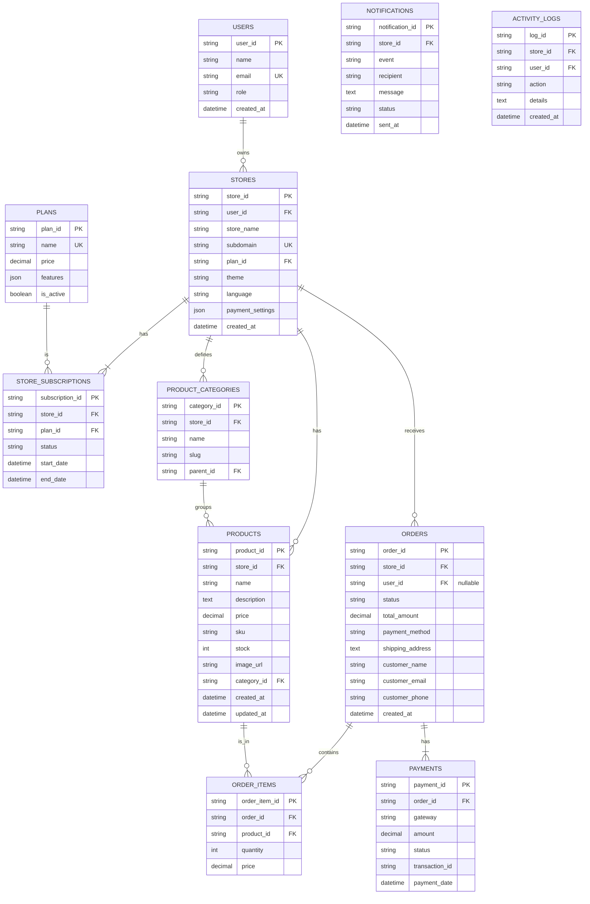

# NexusCart Technical Handoff & System Overview

**Date:** {current_date}
**Version:** 1.6 - Auth Workflow Documentation

This document provides a comprehensive overview of the NexusCart application's architecture, database schema, feature status, and deployment requirements. It is intended for developers, project managers, and new team members.

**Core Architecture:** The application is built on a Next.js App Router framework. The backend logic is handled via **Next.js Server Actions** and **Genkit AI flows**, which interact with a **Firebase Firestore** database.

---

## 1. Database Schema

**Current Status:** All data is persisted in **Firebase Firestore**. The schema below reflects the collections and data structures in use.

### A. Entity-Relationship Diagram (ERD)



### B. Table/Collection Breakdown

| Collection Name        | Status                                   | Description                                                                 |
| ---------------------- | ---------------------------------------- | --------------------------------------------------------------------------- |
| **Users**              | Implemented (Firebase Auth)              | Stores user account information. Firebase Auth is the source of truth.      |
| **stores**             | Implemented (Firestore)                  | Core collection for all stores created on the platform.                     |
| **products**           | Implemented (Firestore)                  | All products listed by a store.                                             |
| **Product Categories** | Implemented (Static Config)              | Categories are defined in `src/lib/config.ts`. Not a dynamic collection yet. |
| **orders**             | Implemented (Firestore)                  | Records all customer orders for a store.                                    |
| **Order Items**        | Implemented (Sub-collection of `orders`) | Line items are stored as an array within each Order document.               |
| **Payments**           | Not Implemented                          | Tracks payment transactions associated with orders.                         |
| **Plans**              | Implemented (Static Config)              | Available subscription plans are defined in `src/lib/config.ts`.            |
| **Store Subscriptions**| Not Implemented                          | Associates a store with a specific plan and tracks its subscription status. |
| **Notifications**      | Not Implemented (Logic is ephemeral)     | Logs all outgoing notifications (WhatsApp, Email) for tracking.             |
| **Activity Logs**      | Not Started                              | Logs significant actions performed by users within a store.                 |
| **Store Settings**     | Implemented (Fields on `stores` doc)     | Key-value store for various store-specific settings.                        |
| **Themes**             | Implemented (Handled by CSS)             | Theme configurations are handled by CSS variables in `globals.css`.         |
| **Translations**       | Implemented (Handled by JSON files)      | All text is managed via `src/locales` JSON files.                           |

---

## 2. Features – Status Checklist

### Features 100% Complete
- **Authentication & Authorization**: See the detailed **Authentication Workflow** section below for a full breakdown.
- **Database Persistence (Firestore)**: All application data (Stores, Products, Orders) is now persisted in Firebase Firestore. All Server Actions correctly interact with the database via the service layer in `src/lib/firebase-service.ts`.
- **Theme/Color Selection**: Theming system is fully implemented with 7+ themes. Users can select a theme, and it's applied across the dashboard and storefront. State is persisted in `localStorage`.
- **Multilingual Support**: The entire UI is translated into English and Nepali. A `useTranslation` hook and language files (`/src/locales`) manage all text. User preference is persisted.
- **AI Product Description (UI/Backend)**: The "Generate with AI" buttons on the Add/Edit Product pages are fully functional, calling a Genkit flow to populate the description field.
- **PWA Support**: The application is configured as a Progressive Web App with a manifest file and service worker registration.
- **Manual Payment Gateway Configuration**: Store owners can configure their own payment details for "Cash on Delivery," "QR Code Payments," and "Bank Transfers" via the settings dashboard. This includes QR code image uploads and structured bank account details.
- **Manual Checkout Flow**: The storefront checkout process is fully implemented for COD, QR, and Bank Transfer methods. It dynamically displays the store-specific payment information to the customer and creates orders in Firestore with a "Processing" or "Pending" status for manual verification by the seller.
- **Khalti Payment Gateway Integration**:
    - **Configuration**: Store owners can add their Khalti secret keys and toggle test mode in the settings panel.
    - **Checkout**: Customers can pay via Khalti, which redirects them to the Khalti payment portal.
    - **Verification**: The system automatically verifies payments on the backend via the Khalti lookup API before confirming an order.
    - **Refunds**: Store owners can initiate full refunds for Khalti transactions directly from the order details page.
- **eSewa Payment Gateway Integration**:
    - **Configuration**: Store owners can add their eSewa Merchant Code and Secret Key, and toggle test mode in the settings panel.
    - **Checkout**: Customers can pay via eSewa. The system generates a signed form that auto-submits, redirecting the user to the eSewa payment page.
    - **Verification**: The system automatically verifies payments on the backend via the eSewa Status Check API after the user is redirected back to the app. Orders are only confirmed upon successful verification.
- **Admin Actions (UI & Logic)**:
    - Products: "Add", "Edit", and "Delete" are fully functional, persisting to Firestore.
    - Orders: "View Details," "Mark as Shipped," "Cancel Order," and "Refund Khalti Order" are functional, persisting to Firestore.
    - Settings: Saving "Store Profile," "SEO," and "Payments" changes works, persisting to Firestore.
    - Superadmin: "Add New Store" and store status changes are fully implemented, persisting to Firestore.

### UI/Foundation Only (Backend Logic is Mocked or Incomplete)
- **Plan Management & Subscription Logic**: UI for changing plans is complete. The backend action updates the store's `planId` in Firestore but does not handle billing, payments, or subscription lifecycle events (e.g., renewals, cancellations).
- **Product Category Management**: UI does not exist for dynamic category management. Categories are currently static and defined in a config file.

### Features Not Started
- **Activity Logs**: No UI or backend logic exists for logging user actions.
- **Real-time Analytics**: The dashboard uses static, randomized analytics data.
- **Email Notifications**: No infrastructure or logic exists for sending emails.
- **CI/CD Pipeline**: No deployment automation is configured.

---

## 3. Initial Page and Authentication Workflow

### Initial Page

The first page a user sees depends on the URL they visit:

1.  **Main Platform Domain** (e.g., `your-platform.com`): The user lands on the main welcome page located at `src/app/page.tsx`. This page serves as a central hub with links to either the Superadmin panel or the store owner login.
2.  **Store Subdomain** (e.g., `my-store.your-platform.com`): The `middleware.ts` file detects the subdomain and automatically directs the user to that specific store's public-facing storefront, located at `src/app/store/page.tsx`.

### Authentication Workflow

The authentication system is designed to be secure and robust, using a combination of client-side Firebase authentication and a server-side session cookie for route protection.

**Step-by-Step Login Process:**

1.  **Access Attempt:** A user navigates to a protected route (e.g., `/dashboard` or `/admin`).
2.  **Middleware Interception:** The `middleware.ts` runs on the server's edge. It inspects the incoming request and checks for a `session` cookie. Since the user is not logged in, the cookie is absent.
3.  **Redirection to Login:** The middleware redirects the user to the `/login` page. To ensure a good user experience, it appends the original URL as a `redirectedFrom` query parameter, so the user can be sent back to their intended page after a successful login.
4.  **User Authentication:** On the login page, the user enters their credentials. The client-side code uses the public Firebase keys (from your `.env` file) to communicate with Firebase Auth and sign the user in.
5.  **Server-Side Session Creation:** Upon successful authentication with Firebase, the client receives a temporary `idToken`. This token is immediately sent to the application's backend API route at `POST /api/auth/session`.
6.  **Token Verification & Cookie Issuing:** The backend API route, using the **secret Firebase Admin SDK key**, verifies the `idToken`. If valid, it generates a secure, HttpOnly `session` cookie. This cookie acts as the user's authenticated session for all subsequent server-side requests.
7.  **Secure Navigation to Dashboard:** The login page client code, upon receiving a success response from the backend, performs a **full-page navigation** to the originally intended URL (or `/dashboard`). This is a critical step (`window.location.assign(...)`) that ensures the browser sends the newly-created `session` cookie with the next request.
8.  **Final Access & Authorization:** The user's browser requests the protected route again. The `middleware.ts` intercepts it, finds the valid `session` cookie, and grants access. It also performs authorization by checking if the user is on the correct domain for the requested route (e.g., `/admin` only on the main domain).

**Logout Process:**

-   When a user clicks "Log out," the client-side Firebase session is cleared.
-   Simultaneously, a `DELETE` request is sent to `/api/auth/session`, which instructs the server to clear the HttpOnly `session` cookie, fully terminating the session on both the client and server.

---

## 4. Backend Logic & "API" Documentation

The application uses **Next.js Server Actions** and **API Routes** for backend logic. All actions are defined in `src/app/.../actions.ts` files and interact with the database via `src/lib/firebase-service.ts`.

### Module: Authentication (`/app/api/auth/session/route.ts`)
- `POST /api/auth/session`: Accepts a Firebase ID Token from the client. Verifies it using the Firebase Admin SDK and sets a secure, HTTP-only `session` cookie.
- `DELETE /api/auth/session`: Clears the `session` cookie, effectively logging the user out from the server's perspective.

### Module: Products (`/app/(app)/products/actions.ts`)
- `addProduct(formData)`: Adds a new product. Uploads image via `storage-service`, creates a new document in the `products` collection in Firestore, and revalidates the path.
- `updateProduct(productId, formData)`: Updates an existing product document in Firestore.
- `deleteProduct(productId)`: Deletes a product document from Firestore.
- `generateDescriptionAction(productName)`: Calls the Genkit flow to generate a product description.

### Module: Orders (`/app/(app)/orders/actions.ts`)
- `updateOrderStatus(orderId, status, lang)`: Updates the status of an order document in Firestore.
- `refundKhaltiOrder(orderId)`: Initiates a full refund for a completed Khalti transaction. It calls the Khalti Refund API and updates the order status to "Refunded" in Firestore upon success.

### Module: Settings (`/app/(app)/settings/actions.ts`)
- `updateStoreProfile(storeId, formData)`: Updates a store document's name and description in Firestore.
- `updateStorePlan(storeId, newPlanId)`: Updates a store document's planId in Firestore.
- `updatePaymentSettings(storeId, formData)`: Updates a store's payment details, including QR code, bank info, **Khalti credentials**, and **eSewa credentials**.
- `updateSeoSettings(storeId, data)`: Updates a store document's meta fields in Firestore.
- `suggestKeywordsAction(description)`: Calls Genkit flow to suggest SEO keywords.

### Module: Checkout (`/app/store/checkout/actions.ts`)
- `placeManualOrder(values, cartItems, lang)`: The main checkout handler for manual methods (COD, QR, Bank). Creates an order with 'Pending' or 'Processing' status.
- `initiateKhaltiPayment(values, cartItems)`: Handles the Khalti checkout process. It creates a preliminary order in Firestore, initiates a payment with Khalti's API, and returns the payment URL for redirection.
- `initiateESewaPayment(values, cartItems)`: Handles the eSewa checkout. It creates a preliminary order, generates a secure signature, and returns the necessary form data to the client for auto-redirection to eSewa.

### Module: Khalti Callback (`/app/store/checkout/khalti/callback/actions.ts`)
- `verifyKhaltiPayment(pidx)`: Called on the server after the user returns from Khalti. It uses the `pidx` to call Khalti's lookup API, verifies the transaction status, and updates the final order status in Firestore ('Processing' or 'Cancelled').

### Module: eSewa Callback (`/app/store/checkout/esewa/callback/actions.ts`)
- `verifyESewaPayment(base64Data)`: Called after the user returns from eSewa. It decodes the Base64 data, verifies the signature, and makes a server-to-server call to eSewa's Status Check API to confirm the transaction before updating the order status in Firestore.

### Module: AI & Notifications
- **AI Flows (`/src/ai/flows/*.ts`):** Genkit flows for product description generation, SEO keyword suggestion, and a chat assistant. They are self-contained and called by Server Actions.

### Third-Party Integrations
- **Firebase**: For user authentication (Client SDK), database (Firestore), and server-side session management (Admin SDK). Fully implemented.
- **Genkit (Google AI)**: For all AI features. Fully implemented.
- **Khalti**: For real-time payments and refunds. Fully implemented.
- **eSewa**: For real-time payments. Fully implemented.
- **Google Cloud Storage**: For image uploads. Implemented and fully functional.

---

## 5. What’s Live, What’s Not

### Live & Production-Ready (Conceptually)
- User Authentication & Session Management.
- The entire data layer and database persistence via Firebase Firestore.
- The entire user interface, including multilingual support and theme selection.
- All admin actions and forms, which are correctly wired to server actions that modify the database.
- AI features for content generation.
- PWA configuration.
- Manual payment configuration (QR, Bank, COD) by store owners.
- **Khalti Payment Gateway**: End-to-end payment processing, including configuration, checkout, server-side verification, and refunds.
- **eSewa Payment Gateway**: End-to-end payment processing, including configuration, checkout, and server-side verification.

### UI Only / Mocked Backend
- **Subscription Billing**: The app does not handle recurring payments or subscription lifecycle management.
- **Real-time Analytics**: The dashboard uses randomized data, not real aggregates from the database.

### Not Started
- eSewa Refunds (API not provided).
- Activity logs and auditing.
- Email sending infrastructure.
- Database backups, migrations, and seeding strategy.

---

## 6. Deployment, Security, and Tech Stack

### Tech Stack
- **Framework**: Next.js 15.3.3 (App Router)
- **Language**: TypeScript
- **Database**: Firebase Firestore
- **Authentication**: Firebase Auth (Client & Admin SDKs)
- **UI**: React 18, Tailwind CSS, ShadCN UI
- **AI**: Google AI via Genkit
- **File Storage**: Google Cloud Storage

### Environment Variables
The following variables must be set in a `.env` file for full functionality.

```env
# ----------------------------------------------------------------------------------
# Firebase Client SDK (Required for client-side Auth & DB)
# ----------------------------------------------------------------------------------
# To get these values:
# 1. Go to your Firebase Console (https://console.firebase.google.com/).
# 2. Click the Gear icon > Project settings.
# 3. In the "General" tab, scroll down to the "Your apps" section.
# 4. Find your Web App and click on the "SDK setup and configuration" button.
# 5. Select "Config" and copy the values into the variables below.
# ----------------------------------------------------------------------------------
NEXT_PUBLIC_FIREBASE_API_KEY=
NEXT_PUBLIC_FIREBASE_AUTH_DOMAIN=
NEXT_PUBLIC_FIREBASE_PROJECT_ID=
NEXT_PUBLIC_FIREBASE_STORAGE_BUCKET=
NEXT_PUBLIC_FIREBASE_MESSAGING_SENDER_ID=
NEXT_PUBLIC_FIREBASE_APP_ID=

# ----------------------------------------------------------------------------------
# Firebase Admin SDK (Required for server-side session management & route protection)
# ----------------------------------------------------------------------------------
# To get this:
# 1. Go to your Firebase Console > Project Settings > Service accounts tab.
# 2. Click "Generate new private key" and download the JSON file.
# 3. Open the file, copy its ENTIRE contents, and paste it here as a SINGLE-LINE string.
#    (You may need to use an online tool to convert the JSON to a single line).
# ----------------------------------------------------------------------------------
FIREBASE_ADMIN_SDK_JSON=

# ----------------------------------------------------------------------------------
# Google Cloud Storage (Required for real image uploads)
# ----------------------------------------------------------------------------------
# These values are found in the same JSON key file from the step above.
# ----------------------------------------------------------------------------------
GCS_PROJECT_ID=
GCS_BUCKET_NAME=
# The full JSON key file content as a single-line string (can be the same as FIREBASE_ADMIN_SDK_JSON)
GOOGLE_APPLICATION_CREDENTIALS_JSON=
```

### Security Measures
- **Authentication**: Handled by Firebase Auth, which is robust and secure.
- **Input Validation**: Client-side validation is performed with `zod` and `react-hook-form`. Basic server-side checks are present in most actions.
- **Route Protection & Session Management**: Route protection is handled by `middleware.ts`. It provides domain-aware authentication (checking for a secure, HTTP-only `session` cookie) and authorization (ensuring admin routes are on the main domain and app routes are on subdomains). The session cookie is created via the `/api/auth/session` API route upon successful login, creating a secure bridge between client-side authentication and server-side route protection.
- **CORS**: Handled by Next.js defaults.
- **Password Storage**: Handled securely by Firebase.

### Recommendations
- **Implement Firestore Security Rules**: Add robust security rules to your Firestore database to prevent unauthorized data access directly from the client.
- **Implement Role-Based Access Control (RBAC)**: Enforce user roles (e.g., 'store_owner', 'super_admin') in server actions to prevent unauthorized data access.

---

## 7. Additional Notes & Recommendations

### Technical Debt & Refactoring
1.  **Static Data in Config**: Plans and Categories are currently hardcoded in `src/lib/config.ts`. For more flexibility, these could be migrated to their own Firestore collections.
2.  **Analytics Data**: The dashboard analytics are currently randomized. A real implementation should aggregate data from the `orders` collection.

### Best Practices & Next Steps
1.  **Set Up Logging and Monitoring**: Integrate a service like Sentry or Logtail for error tracking and application monitoring.
2.  **Define Firestore Security Rules**: This is crucial for securing your database before going to production.
3.  **Create a CI/CD Pipeline**: Automate testing and deployment using GitHub Actions or a similar service.

### Blockers
- **External Service Credentials**: Full functionality for certain features (GCS, Firebase Admin) is blocked pending the acquisition and configuration of API keys and credentials.
